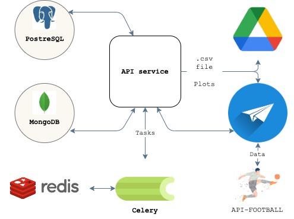

# analytics-publisher

The app consists of API service, which provides information about football clubs, and telegram bot.

**API service**

- API service has endpoints:
    1) GET /clubs (information about clubs)
    2) GET /clubs/{club_id} (information about each club)
    3) POST /clubs (creates a club)
and also endpoints to export information into the telegram bot.

- The data about club are stored in PostgreSQL, the data about pages' views are stored in MongoDB (inc. time, user IP).
- There are cron jobs, implemented with using Celery, which export data about pages' views to .csv file and to plots in .png format.
- The are three types of plots:
    1) with bars, which shows total views of clubs during the specific period of time,
    2) lineplot, which shows dynamics of views during the specific period of time,
    3) displot, which shows distribution of data.
- All the files are saved to Google Disk.

**Telegram bot**

- In the bot with /start you will have several buttons:
    - buttons for getting plots,
    - buttons for getting information, using a source [Api-Football](https://www.api-football.com).
____

 


## Links
This project was built using these tools:
| Tool | Description |
|----------|---------|
| [FastAPI](https://fastapi.tiangolo.com/) | "Web framework for building APIs with Python" |
| [Python Telegram Bot](https://docs.python-telegram-bot.org/en/stable/index.html#) | "This library provides a pure Python, asynchronous interface for the Telegram Bot API" |
| [Celery](https://docs.celeryq.dev/en/stable/index.html) | "A task queue with focus on real-time processing, while also supporting task scheduling" |
| [PostgreSQL](https://www.postgresql.org/) |  "An open source object-relational database system" |
| [SQLAlchemy](https://www.sqlalchemy.org/) |  "The Python SQL toolkit and Object Relational Mapper" |
| [MongoDB](https://www.mongodb.com/) |  "A NoSQL database program" |
| [seaborn](https://seaborn.pydata.org/index.html) | "A Python data visualization library based on matplotlib" |
| [poetry](https://python-poetry.org/) |  "Python dependency management and packaging made easy" |


## Installation
**Copy a project**
```
$ git clone git@github.com:Dddarknight/analytics-publisher.git
$ cd analytics-publisher
```

**Set up environment variables**
``` 
$ touch .env

# You have to fill .env file. See .env.example.
# You will have to:
# 1) fill username and password fields for PostgreSQL, RabbitMQ. If you don't have these credentials, please follow the instructions in the official documentation.
# 2) make a telegram bot and put its token to a TG_API_TOKEN variable.
# 3) register on Api-Football and put api-token to a API_FOOTBALL variable.
```

**Set up the environment**
```
$ pip install poetry
$ make install
```

**Launch API server**
```
$ make run
```

**Launch a bot**
```
$ make bot
```

**Launch Celery**
```
# You have to run celery in two terminals with these commands.

$ celery -A api_app.celery_tasks beat --loglevel=info
$ celery -A api_app.celery_tasks worker --loglevel=info --pool solo
```

## License
[GNU GPLv3](https://choosealicense.com/licenses/gpl-3.0/)